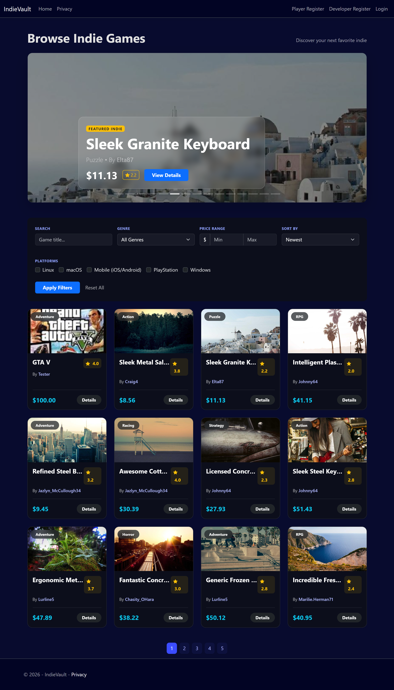
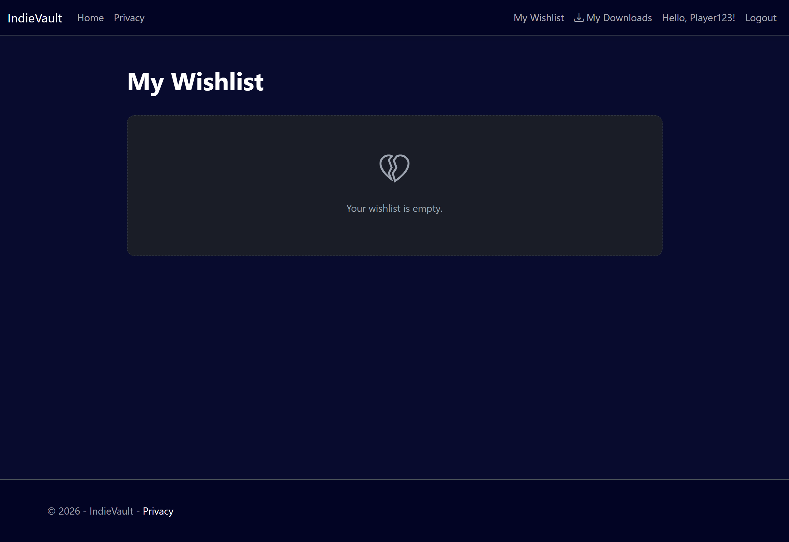
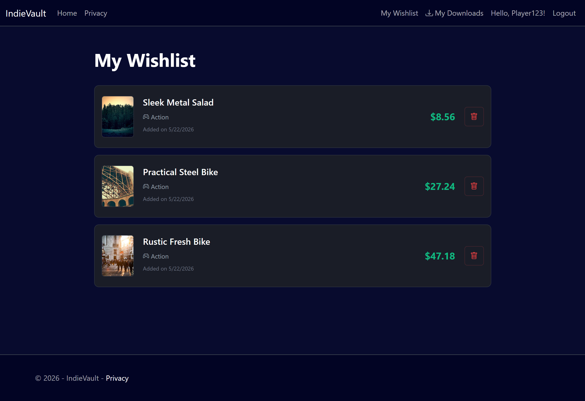
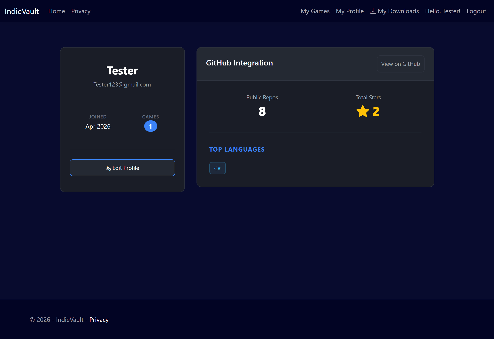
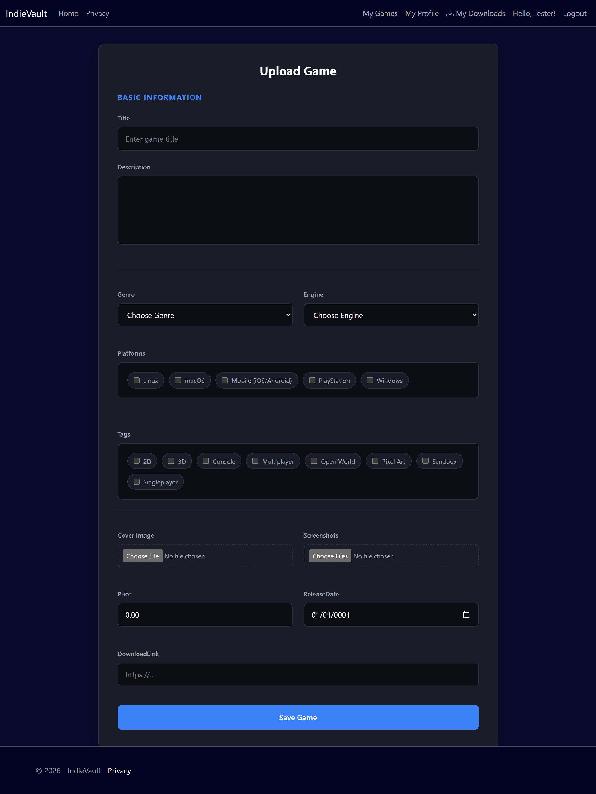

# IndieVault 🎮

A full-stack ASP.NET Core MVC web application where indie game developers 
can showcase their work, players can discover and download games, 
and admins can manage the platform.

## Roles
- **Game Dev** — upload, edit, and manage their own games
- **Player** — browse, wishlist, download, and review games
- **Admin** — manage genres, feature games, and oversee the platform

## Features
- Role-based authentication with ASP.NET Core Identity
- Game upload with cover image and screenshots
- Advanced search, filtering, sorting, and pagination
- Wishlist functionality with AJAX (no page reload)
- Review system with 1-5 star ratings
- Developer profiles with GitHub API integration
- Admin dashboard with platform statistics
- Global exception handling with file logging
- Custom 404 and 500 error pages

## Screenshots

### Discovery (Home & Search)


### Game Details


### Player Interaction



### Developer Experience



### Admin Panel


## Technologies
- ASP.NET Core 9 MVC
- Entity Framework Core (Code-First)
- Dapper (read-heavy queries)
- MySQL
- ASP.NET Core Identity
- Razor Views
- Bootstrap 5
- JavaScript (Fetch API / AJAX)
- GitHub REST API
- Bogus (seed data)
- xUnit (unit tests)

## Architecture
- MVC pattern with ViewModels and DTOs
- Hybrid data access: EF Core for writes, Dapper for complex reads
- Service layer for GitHub API integration
- Custom middleware for global exception handling
- Role-based authorization throughout

## Setup

### Prerequisites
- .NET 9 SDK
- MySQL Server
- Visual Studio 2026

### Steps
1. Clone the repository
   git clone:
   ```
   https://github.com/Umer-Iftikhar/indie-vault
   ```

2. Restore dependencies:
   ```
   dotnet restore
   ```

3. Add connection string via user secrets:
   ```
   dotnet user-secrets set "ConnectionStrings:DefaultConnection" 
   "server=localhost;database=IndieVault;user=root;password=your-password"
   ```

4. Run migrations:
   Open Package Manager Console in Visual Studio
   ```
   Update-Database
   ```

5. Run the application
   The database will be seeded automatically on first run in Development.

### Default Admin Account
- Email: admin@indiehub.com
- Password: Password123!

## Testing
Unit tests are in the `IndieVault.Tests` project.
Run via: Test → Run All Tests in Visual Studio

## Notes
- GitHub API integration requires no API key (public data, 60 req/hour limit)
- Game images are stored in `wwwroot/images/games/{gameId}/`
- Error logs are written to `errors.log` in the project root

## Project Structure
```
IndieVault/
├── Controllers/      — HTTP request handling
├── Models/           — Database entities
├── ViewModels/       — Controller → View data transfer
├── DTOs/             — Service layer data transfer
├── Views/            — Razor templates
├── Services/         — Business logic and external APIs
├── Data/             — DbContext, migrations, seeder
├── Middleware/       — Global exception handling
├── Extensions/       — Middleware registration extensions
├── Enums/            — Shared enumerations
└── wwwroot/          — Static files (CSS, JS, images)

IndieVault.Tests/     — xUnit unit tests
```